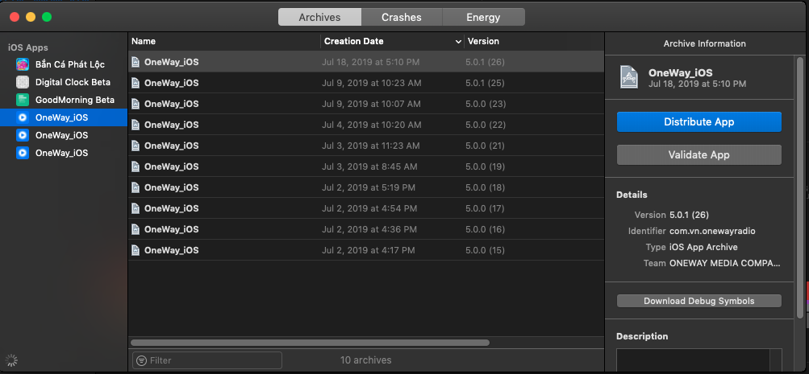
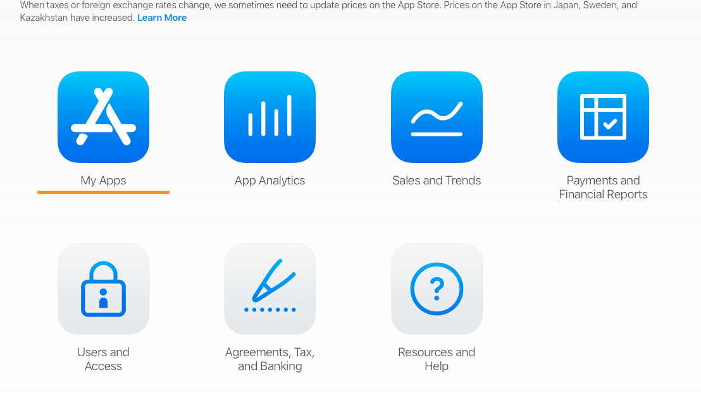
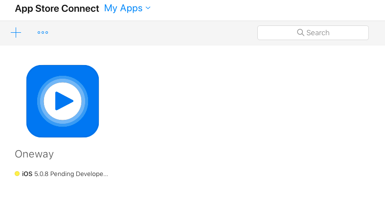
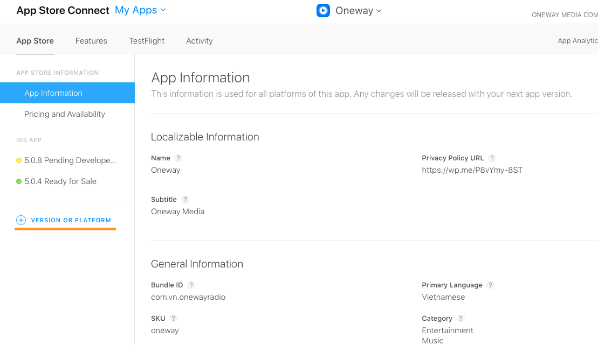
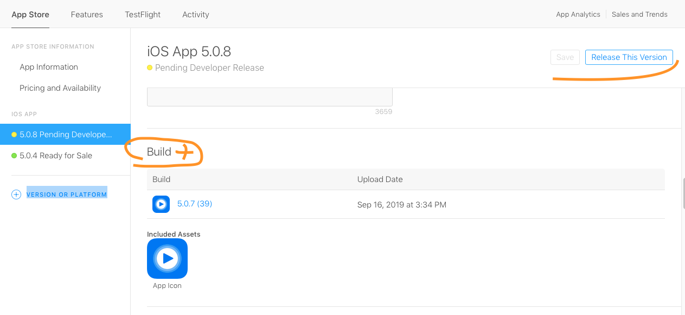
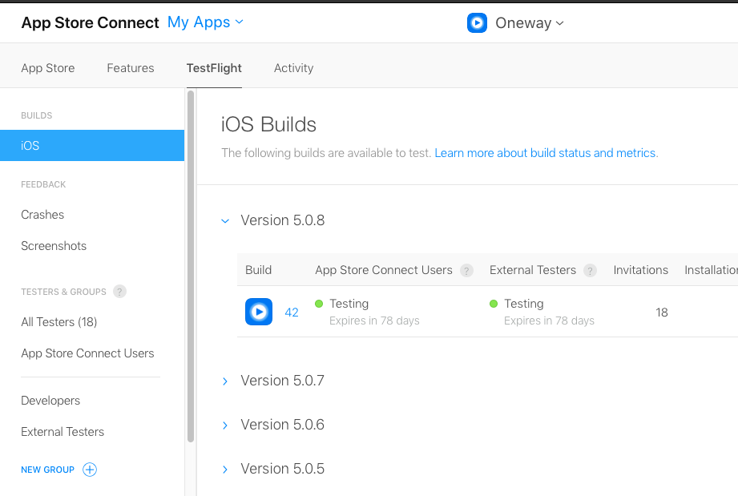

# Hướng dẫn OneWay

- [Hướng dẫn OneWay](#h%c6%b0%e1%bb%9bng-d%e1%ba%abn-oneway)
  - [Run Project](#run-project)
  - [Upload Store](#upload-store)
    - [Tài khoản](#t%c3%a0i-kho%e1%ba%a3n)
    - [Upload Tự động](#upload-t%e1%bb%b1-%c4%91%e1%bb%99ng)
    - [Upload bằng tay](#upload-b%e1%ba%b1ng-tay)
  - [Xử lý app trên App Store](#x%e1%bb%ad-l%c3%bd-app-tr%c3%aan-app-store)
    - [Tạo phiên bản mới trên App Store](#t%e1%ba%a1o-phi%c3%aan-b%e1%ba%a3n-m%e1%bb%9bi-tr%c3%aan-app-store)
    - [Xem phiên bản đã upload](#xem-phi%c3%aan-b%e1%ba%a3n-%c4%91%c3%a3-upload)

## Run Project

- Clone từ Gitlab về
- Mở terminal lên, mở thư mục project (“cd” vào thư mục project)
- Cài thư viện: “pop install”
- Mở project bằng file: “*.xcworkspace”

## Upload Store

### Tài khoản

- duynp@oneway.vn
- Oneway2019

### Upload Tự động

trong terminal chạy lệnh:
> bundle exec fastlane release_testflight

### Upload bằng tay

- Login tài khoản trong Xcode: Xcode/ Preference/ Account
- Xcode > Product > Archive
- View All Archives: Window > Organizer
  - Click: Distributte App

## Xử lý app trên App Store

- Truy cập: https://appstoreconnect.apple.com
- Chọn: My App > Chọn App Muốn chỉnh

### Tạo phiên bản mới trên App Store

- Menu App Store/ (+) VERSION OR PLATFORM/ iOS

- Click (+) gần build, Chọn Phiên bản upload, Chọn Review (hay Release)

### Xem phiên bản đã upload

- Menu TestFight/ iOS

---
