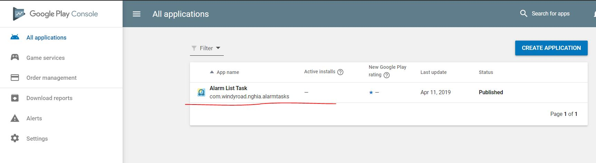
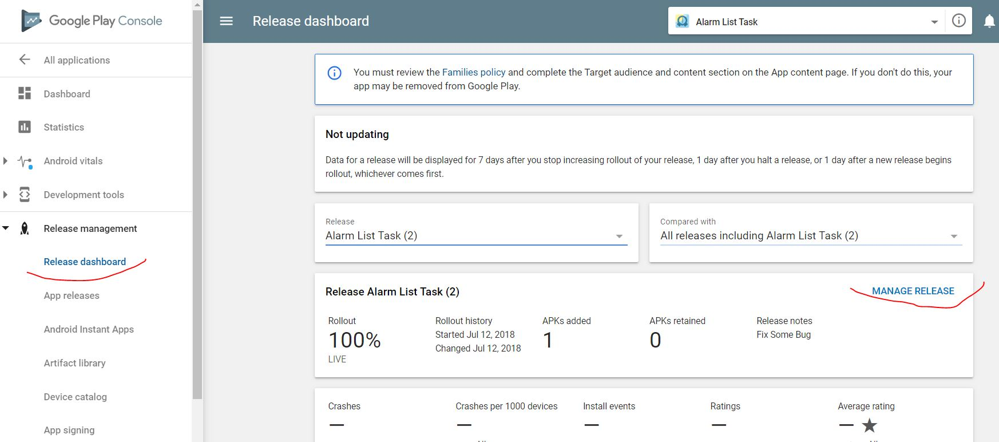
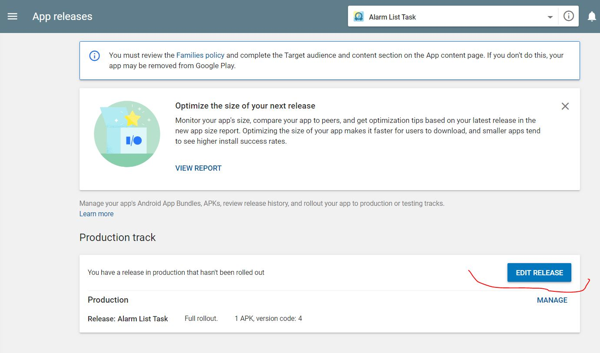
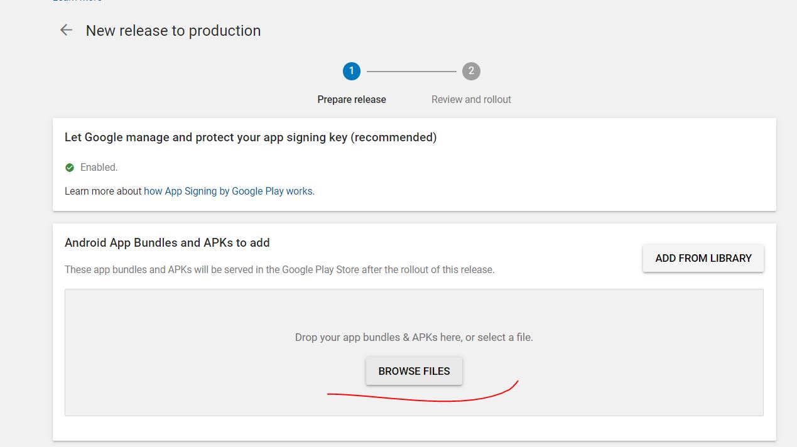
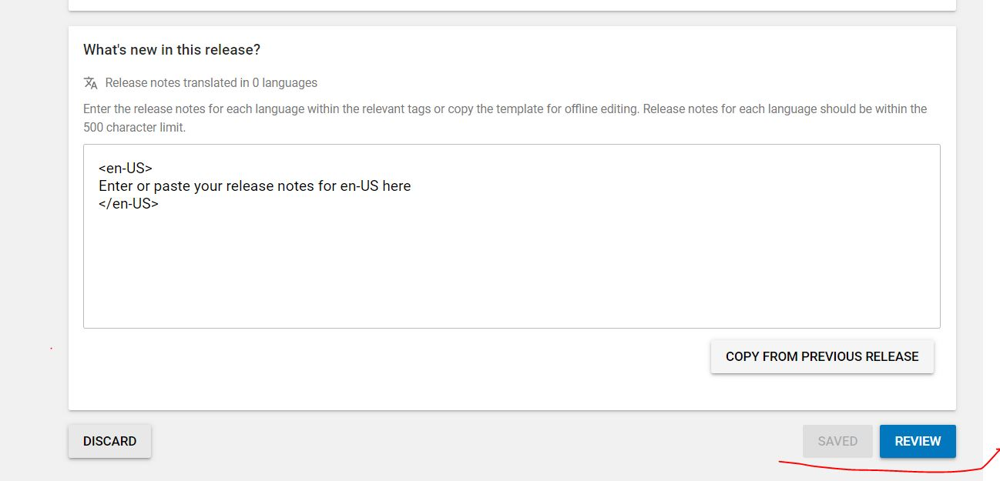

# Hướng dẫn Google Play

- [Hướng dẫn Google Play](#h%c6%b0%e1%bb%9bng-d%e1%ba%abn-google-play)
  - [Upload App mới](#upload-app-m%e1%bb%9bi)
  - [Tạo file Apk mới](#t%e1%ba%a1o-file-apk-m%e1%bb%9bi)
  - [Upload New version](#upload-new-version)
  - [Tham Khảo](#tham-kh%e1%ba%a3o)

## Upload App mới

- <https://vntalking.com/submit-ung-dung-len-google-play-store.html>

## Tạo file Apk mới

- Áp dụng Oneway
  - file chỉnh sửa version: Config.gradle
versionMajor        : 2,
versionMinor        : 0,
versionPatch        : 9,
  - file keystore: \app\keyvault\release.keystore
  - file password: gradle.properties > RELEASE_STORE_PASSWORD

- Menu Build> Generate Signed Bundle/Apk...>

(Oneway - file password: gradle.properties > RELEASE_STORE_PASSWORD)

## Upload New version

- Truy cập Google Play Console: <https://play.google.com/apps/publish>
- Làm theo các bước:

- Chọn ứng dụng chỉnh sửa

- Chọn Release Dashboard

- Chọn Edit Release

- Upload file Apk mới

- Gởi Review Apk mới

---

## Tham Khảo

- <https://vntalking.com/submit-ung-dung-len-google-play-store.html>
